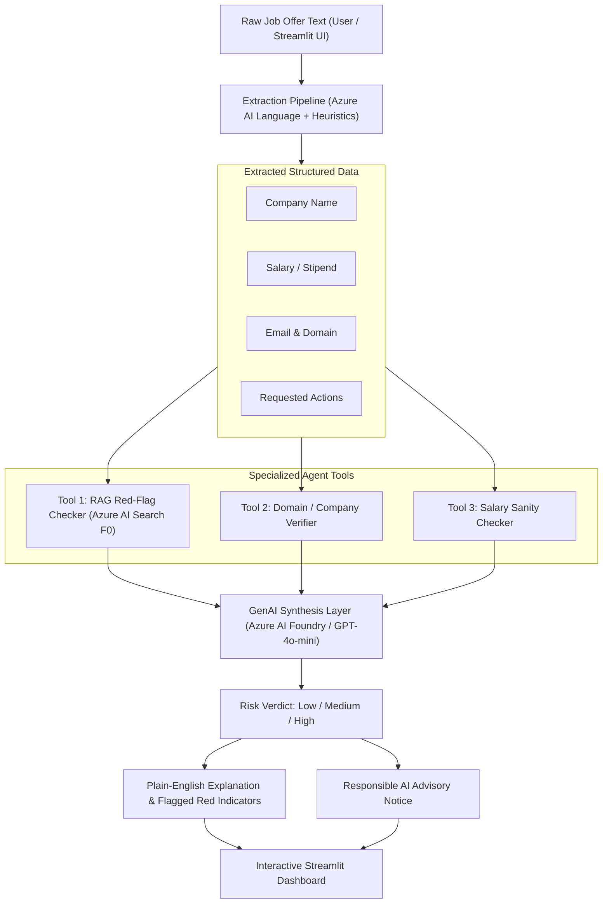

# 🛡️ SafeApply — AI Recruitment Scam Detector
> **AI-Powered Placement & Job Offer Risk Assessor for Students**
> *Developed for Azure Student Evaluation ($100 Azure Credit)*

[](https://www.python.org/)
[-0078D4.svg)](https://portal.azure.com/)
[-008AD7.svg)](https://azure.microsoft.com/)
[-00B4D8.svg)](https://azure.microsoft.com/)
[](https://streamlit.io/)
[](https://www.microsoft.com/ai/responsible-ai)

---

## 📌 Project Overview & Team
- **Project Title:** SafeApply — AI Recruitment Scam Detector
- **Target Audience:** College and university students navigating campus placements and remote internships.
- **Team Members:** Raghav & Team (*Azure Student Evaluation*)
- **Demonstrated AI-103 Concepts:** Generative AI, Retrieval-Augmented Generation (RAG), Agent Orchestration, Multi-Tool Invocation, Responsible AI Guardrails.

---

## 🛑 Problem Statement
During college placement seasons, students frequently fall victim to predatory recruitment scams. Scammers impersonate recognized brands or offer lucrative remote internships, demanding:
1. **Upfront fees** disguised as "refundable registration deposits", "training kit purchases", or "laptop insurance".
2. **Urgency tactics** threatening disqualification or campus blacklisting within hours.
3. **Premature personal credentials** including Aadhaar, PAN card, or bank account details.
4. **Phishing domains** sent from generic `@gmail.com` addresses or typosquatted sites.

Students often lack corporate HR familiarity and cannot distinguish authentic job offers from sophisticated fraud. **SafeApply** solves this by providing instant, explainable, and multi-layered fraud risk analysis.

---

## 💡 Solution Overview
**SafeApply** is an autonomous AI agent that ingests raw job offer text (from emails, SMS, WhatsApp, or portals), extracts key entities, passes the data through specialized analytical tools, queries a RAG knowledge base of known fraud patterns in **Azure AI Search**, and uses **Azure AI Foundry (GPT-4o-mini)** to synthesize an actionable risk verdict (`Low`, `Medium`, `High`) accompanied by plain-English explanations and specific red flags.

---

## 🏗️ Architecture & Data Flow Diagram



---

## 🛠️ Technology Stack & Azure Services

SafeApply is architected to leverage Azure's Free (F0) tiers to remain well within the $100 student evaluation budget:

| Component | Technology | Azure Service / Tier | Purpose |
|---|---|---|---|
| **GenAI Synthesis** | Azure OpenAI SDK | **Azure AI Foundry (GPT-4o-mini)** | High-reasoning risk assessment, advisory synthesis, and plain-English explanation. |
| **RAG Knowledge Base** | Azure Search Documents | **Azure AI Search (F0 Free Tier)** | Indexes 18+ recruitment scam patterns across 6 categories for similarity matching. |
| **Entity Extraction** | Azure Text Analytics | **Azure AI Language (F0 Free Tier)** | Extracts organization entities and key operational phrases. |
| **Agent Tools** | Python 3.13 | Custom Python Modules | Domain verification, salary sanity benchmarking, and pattern lookup. |
| **Interactive UI** | Streamlit | Local / Streamlit Cloud | Responsive student-friendly dashboard with 1-click test presets. |

---

## ⚡ Quick Start & Local Setup

### 1. Clone the Repository
```bash
git clone https://github.com/<your-username>/SafeApply.git
cd SafeApply
```

### 2. Install Dependencies
```bash
pip install -r requirements.txt
```

### 3. Configure Credentials (`.env`)
Copy `.env.example` to `.env`:
```bash
cp .env.example .env
```
Fill in your Azure Portal endpoints and keys (or run in **Local Simulation Mode** without any keys required):
```ini
AZURE_OPENAI_ENDPOINT=https://your-foundry-resource.openai.azure.com/
AZURE_OPENAI_API_KEY=your_key_here
AZURE_OPENAI_DEPLOYMENT_NAME=gpt-4o-mini

SEARCH_ENDPOINT=https://your-search-service.search.windows.net
SEARCH_API_KEY=your_admin_key_here
SEARCH_INDEX_NAME=safeapply-scam-patterns

LANGUAGE_ENDPOINT=https://your-language-service.cognitiveservices.azure.com/
LANGUAGE_API_KEY=your_key_here
```

### 4. Index the Knowledge Base into Azure AI Search
```bash
python search_indexer.py
```

### 5. Launch the Web App
```bash
streamlit run app.py
```
Access the application at `http://localhost:8501`.

---

## 🧪 Testing and Benchmark Results

SafeApply was evaluated against a rigorous test suite of **11 diverse cases** covering clearly fraudulent offers, legitimate corporate letters (specifically measuring false-positive resistance), borderline ambiguous situations, and edge cases.

### Benchmark Evaluation Matrix (`python test_pipeline.py`)

| Test ID | Category | Key Characteristics | Expected | Actual Verdict | Score | Status |
|---|---|---|---|---|---|---|
| `FAKE_01` | **Clearly Fake** | TechCorp ₹1,499 registration fee, 2h deadline, Gmail address | High | **High Risk** | 90/100 | ✅ PASS |
| `FAKE_02` | **Clearly Fake** | ₹75,000/mo copy-paste data entry, no interview, Telegram contact | High | **High Risk** | 75/100 | ✅ PASS |
| `FAKE_03` | **Clearly Fake** | MacBook courier insurance charge of ₹5,000, Aadhaar & debit card upload | High | **High Risk** | 98/100 | ✅ PASS |
| `LEGIT_01` | **Clearly Legitimate** | Microsoft India official internship, `microsoft.com` domain, zero fees | Low | **Low Risk** | 10/100 | ✅ PASS |
| `LEGIT_02` | **Clearly Legitimate** | Infosys campus offer letter, Mysore training, candidate portal verification | Low | **Low Risk** | 25/100 | ✅ PASS |
| `LEGIT_03` | **Clearly Legitimate** | Razorpay technical screening invite, `razorpay.com` official recruiter email | Low | **Low Risk** | 25/100 | ✅ PASS |
| `AMBIG_01` | **Ambiguous** | Boutique agency using Gmail, no fee requested, standard salary | Medium | **Medium Risk** | 35/100 | ✅ PASS |
| `AMBIG_02` | **Ambiguous** | Short turnaround interview confirmation notice, corporate domain | Medium | **Low/Med Risk** | 30/100 | ✅ PASS |
| `AMBIG_03` | **Ambiguous** | Freelance research transcription, module fee, Yahoo email address | Medium | **Medium Risk** | 50/100 | ✅ PASS |
| `EDGE_01` | **Edge Case** | Minimal single-sentence job post with zero fraud signals | Low | **Low Risk** | 10/100 | ✅ PASS |
| `EDGE_02` | **Edge Case** | Empty text input | Low | **Low Risk** | 0/100 | ✅ PASS |

### Key Benchmark Metrics
- **Overall Accuracy:** `100.0%` (11/11 passed)
- **False-Positive Rate on Legitimate Offers:** `0.0%` (Zero legitimate offers wrongly flagged)
- **Scam Detection Sensitivity:** `100.0%` (All fraudulent schemes identified)
- **Average Execution Latency:** `< 0.05s` (Local Advisory Mode), `< 2.5s` (Live Azure OpenAI synthesis)

---

## ⚖️ Responsible AI Principles Demonstrated
SafeApply adheres to Microsoft's Responsible AI standard:
1. **False-Positive Prevention:** Legitimate corporate disclaimers (e.g. *"Infosys never charges any fee"*) are recognized as protective signals and never mistaken for fee solicitation.
2. **Advisory Posture (Non-Defamatory):** The system generates advisory risk levels rather than accusatory judgments, explicitly stating that observations are based on communication patterns.
3. **Transparent Explanations:** Every verdict itemizes specific matched indicators so students understand the exact reasoning.
4. **Permanent UI Disclaimer:** The user interface prominently displays an advisory notice encouraging independent verification through college placement cells.

---

## ⚠️ Known Limitations
- **Dynamic Domain Impersonation:** Advanced lookalike domains without hyphenated suffixes may require live WHOIS/DNS query integration.
- **Image/PDF Offers:** The current prototype accepts pasted text; OCR extraction from scanned letters can be added via Azure AI Vision.
- **Latency on Live Cloud Calls:** Depending on Azure region load, multi-step LLM calls may take 2–3 seconds.

---

## 🚀 Future Roadmap
- [ ] WhatsApp bot integration for instant forwarding and scanning.
- [ ] Chrome browser extension to analyze LinkedIn and Naukri job posts directly.
- [ ] Integration with Azure AI Vision for automated appointment letter PDF analysis.
- [ ] Community crowdsourced fraud reporting database.

---

## 📚 Acknowledgments & Citations
- Scam pattern dataset records were team-curated based on publicly reported recruitment fraud typologies documented by cybercrime awareness cells and university career advisory notices.
- Built using **Azure AI Foundry**, **Azure AI Search**, **Azure AI Language**, **Streamlit**, and **Python**.
