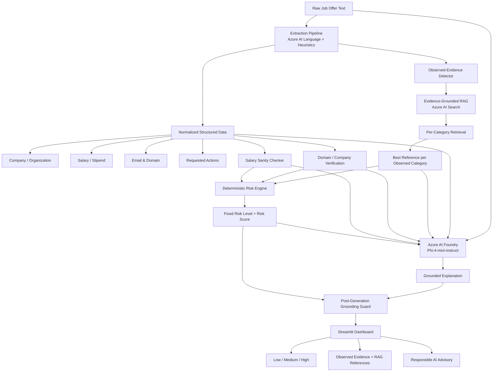

# 🛡️ SafeApply — AI Recruitment Scam Detector

> **AI-Powered Placement & Job Offer Risk Assessor for Students**

> *Developed for Azure Student Evaluation*

[](https://www.python.org/)
[-0078D4.svg)](https://portal.azure.com/)
[-008AD7.svg)](https://azure.microsoft.com/)
[-00B4D8.svg)](https://azure.microsoft.com/)
[](https://streamlit.io/)
[](https://www.microsoft.com/ai/responsible-ai)

---

## 📌 Project Overview & Team

- **Project Title:** SafeApply — AI Recruitment Scam Detector
- **Target Audience:** College and university students navigating campus placements, internships, and entry-level recruitment.
- **Team Members:** Raghav & Team
- **Demonstrated AI Concepts:** Generative AI, Retrieval-Augmented Generation (RAG), agent orchestration, multi-tool invocation, evidence grounding, and Responsible AI safeguards.

---

## 🛑 Problem Statement

Students are frequently targeted by fraudulent recruitment messages that imitate legitimate employers or offer unrealistic remote jobs. Common tactics include:

1. **Upfront fees** disguised as refundable registration deposits, training charges, security deposits, courier insurance, or onboarding payments.
2. **Urgency and pressure tactics** that demand action within minutes or hours.
3. **Premature requests for sensitive information** such as Aadhaar, PAN, bank-account details, OTPs, or authentication credentials.
4. **Suspicious recruiter domains or communication channels**, including public email services, typosquatted domains, and chat-only contact.
5. **Unrealistic compensation or vague hiring processes**, such as unusually high pay without screening or direct selection without interviews.
6. **Fake-check and equipment-purchase schemes**, where candidates are instructed to deposit a check and purchase equipment or software.

SafeApply provides an explainable, multi-layered risk assessment that helps students identify suspicious recruitment patterns while avoiding unsupported accusations.

---

## 💡 Solution Overview

SafeApply accepts raw job-offer text from sources such as email, SMS, WhatsApp, or recruitment portals and processes it through a structured AI pipeline.

The system:

- extracts company, salary, recruiter domain, and requested actions;
- detects evidence directly present in the offer;
- retrieves relevant recruitment-fraud patterns from **Azure AI Search**;
- checks recruiter-domain consistency;
- performs salary sanity analysis;
- calculates a deterministic evidence-based risk score;
- sends the original offer, grounded evidence, tool outputs, and RAG references to **Azure AI Foundry** for a plain-English explanation;
- applies a post-generation grounding check to prevent unsupported claims from retrieved documents from appearing in the final response.

The final result is presented as **Low**, **Medium**, or **High** risk with a score, evidence-backed explanation, and advisory notice.

---

## 🏗️ Architecture & Data Flow



### Why the RAG pipeline is evidence-grounded

SafeApply does **not** treat retrieved fraud-pattern documents as facts about the current offer.

Instead:

```text
Current Offer
    ↓
Observed Evidence
    ↓
Observed Categories
    ↓
Azure AI Search per category
    ↓
Reference Pattern
    ↓
Grounding Gate
    ↓
Foundry Explanation
```

For example, if a retrieved pattern mentions:

```text
bank account + UPI PIN + internet banking password
```

but the current offer only requests:

```text
bank account details
```

SafeApply must report only the bank-account request. It must not introduce unsupported claims such as a UPI PIN or password request.

---

## 🛠️ Technology Stack & Azure Services

| Component | Technology | Azure Service / Runtime | Purpose |
|---|---|---|---|
| **GenAI Explanation** | OpenAI-compatible Python SDK | **Azure AI Foundry — Phi-4-mini-instruct** | Produces a grounded plain-English explanation of a fixed evidence-based assessment |
| **RAG Knowledge Base** | Azure Search Documents SDK | **Azure AI Search** | Stores and retrieves 20 curated recruitment-risk patterns across 7 categories |
| **Entity / Phrase Extraction** | Azure Text Analytics + local heuristics | **Azure AI Language** | Extracts organizations and key phrases while local rules normalize requested actions |
| **Risk Engine** | Python | Local deterministic logic | Calculates reproducible Low / Medium / High risk score from verified evidence |
| **Domain Verification** | Python rules | Custom Agent Tool | Checks public domains, known corporate domains, suspicious naming, and unverified professional domains |
| **Salary Sanity Check** | Python rules | Custom Agent Tool | Detects compensation claims that are implausible for the stated role |
| **Frontend** | Streamlit | Local / deployable web app | Interactive analysis dashboard and test presets |

---

## 🧠 RAG Knowledge Base

The current knowledge base contains **20 curated pattern records across 7 categories**:

- `upfront_fee`
- `urgency_pressure`
- `domain_mismatch`
- `salary_ratio`
- `premature_personal_info`
- `vague_role_process`
- `fake_check_equipment`

Patterns are deliberately kept as narrow and atomic as possible so a retrieved document does not unnecessarily combine unrelated risk claims.

### Retrieval strategy

SafeApply first identifies categories that are directly supported by evidence in the current offer. Azure AI Search is then queried separately for each observed category.

This prevents one high-scoring fraud category from crowding other relevant categories out of the search result set.

`SAFEAPPLY_TOP_K` controls the maximum number of grounded RAG references returned to the agent.

---

## ⚡ Quick Start & Local Setup

### 1. Clone the repository

```bash
git clone https://github.com/raghavbtech/SafeApply---AI-Agent.git
cd SafeApply---AI-Agent
```

### 2. Install dependencies

```bash
pip install -r requirements.txt
```

### 3. Configure credentials

Copy `.env.example` to `.env`.

**Windows PowerShell:**

```powershell
Copy-Item .env.example .env
```

**macOS / Linux:**

```bash
cp .env.example .env
```

Then add your own credentials to `.env`.

Example configuration:

```ini
AZURE_OPENAI_ENDPOINT=https://your-foundry-endpoint/
AZURE_OPENAI_API_KEY=your_key_here
AZURE_OPENAI_DEPLOYMENT_NAME=Phi-4-mini-instruct
AZURE_OPENAI_API_VERSION=2024-08-01-preview

SEARCH_ENDPOINT=https://your-search-service.search.windows.net
SEARCH_API_KEY=your_admin_key_here
SEARCH_INDEX_NAME=safeapply-scam-patterns
SAFEAPPLY_TOP_K=5

LANGUAGE_ENDPOINT=https://your-language-service.cognitiveservices.azure.com/
LANGUAGE_API_KEY=your_key_here
```

> Never commit the real `.env` file or API keys to GitHub. Commit only `.env.example`.

### 4. Create / refresh the Azure AI Search index

```bash
python search_indexer.py
```

A successful run should create or update the index and upload the current 20 pattern documents.

### 5. Run the evaluation suite

```bash
python test_pipeline.py
```

### 6. Launch the Streamlit app

```bash
streamlit run app.py
```

The default local address is:

```text
http://localhost:8501
```

---

## 🧪 Testing and Evaluation

The current evaluation suite contains:

- **12 benchmark cases**
  - 3 clearly fraudulent
  - 3 clearly legitimate
  - 3 ambiguous / borderline
  - 3 edge cases
- **3 grounding / hallucination regression cases**
- **1 RAG category-coverage test**

### Latest benchmark run

| Test ID | Category | Expected | Actual | Score | Result |
|---|---|---:|---:|---:|---|
| `FAKE_01` | Clearly Fake | High | High | 90/100 | PASS |
| `FAKE_02` | Clearly Fake | High | High | 98/100 | PASS |
| `FAKE_03` | Clearly Fake | High | High | 98/100 | PASS |
| `LEGIT_01` | Clearly Legitimate | Low | Low | 10/100 | PASS |
| `LEGIT_02` | Clearly Legitimate | Low | Low | 10/100 | PASS |
| `LEGIT_03` | Clearly Legitimate | Low | Low | 10/100 | PASS |
| `AMBIG_01` | Ambiguous | Medium | Medium | 40/100 | PASS |
| `AMBIG_02` | Ambiguous | Medium | Medium | 55/100 | PASS |
| `AMBIG_03` | Ambiguous | Medium | Medium | 35/100 | PASS |
| `EDGE_01` | Edge Case | Low | Low | 10/100 | PASS |
| `EDGE_02` | Edge Case | Low | Low | 0/100 | PASS |
| `EDGE_03` | Edge Case | Low* | Medium | 35/100 | PASS |

`*` Edge cases intentionally accept Low or Medium when incomplete context reasonably warrants caution.

### Latest evaluation summary

- **Benchmark acceptance:** `12/12` cases satisfied the predefined acceptance criteria.
- **Clearly legitimate false-positive rate:** `0.0%` (`0/3` legitimate cases returned Medium or High).
- **Grounding regression tests:** `3/3 PASS`.
- **RAG category-coverage test:** `PASS`.
- **Average live pipeline latency in the latest benchmark:** approximately `5.64 seconds/query`.
- **Live GenAI mode:** Azure AI Foundry using `Phi-4-mini-instruct`.

> The `12/12` result should be interpreted as benchmark acceptance, not as a claim of universal 100% real-world classification accuracy.

### Grounding tests

The regression suite specifically verifies that:

- a bank-account request does not become a UPI PIN, OTP, password, or debit-card claim;
- a UPI payment request does not become a UPI PIN request;
- legitimate anti-fraud language such as “we never charge recruitment fees” is not misclassified as a fee demand.

### RAG coverage test

For a deliberately multi-signal fraudulent sample, SafeApply successfully retrieves grounded references for:

```text
domain_mismatch
premature_personal_info
upfront_fee
urgency_pressure
vague_role_process
```

The test also verifies that every returned RAG match carries direct `evidence` from the current offer.

---

## ⚖️ Responsible AI Principles

### 1. Evidence Grounding

Retrieved RAG documents are treated as **reference knowledge**, not as direct observations.

The final explanation must be supported by the original offer text or deterministic tool outputs.

### 2. Hallucination Prevention

SafeApply includes explicit prompt-level grounding rules and a post-generation sanitizer.

For example:

```text
UPI payment ≠ UPI PIN request
```

and:

```text
Bank-account request ≠ OTP/password request
```

### 3. Deterministic Scoring

The GenAI model does not independently choose the final risk score.

The deterministic risk engine calculates the verdict first. Foundry receives that fixed assessment and explains it.

This improves reproducibility across cloud and local fallback execution.

### 4. False-Positive Resistance

Protective statements such as:

```text
The company never charges candidates a recruitment fee.
```

are treated as protective language unless the same communication separately makes an affirmative payment request.

### 5. Advisory, Non-Defamatory Output

SafeApply does not make an absolute declaration that a named company is fraudulent.

It evaluates the submitted communication and describes observed patterns associated with recruitment scams.

### 6. Human Verification

Users are advised to verify suspicious communications through independently obtained official company channels, corporate career portals, or university placement cells before sending funds or sensitive information.

---

## ⚠️ Known Limitations

- **Domain verification:** The current PoC contains a small known-company domain mapping and heuristic checks. It does not provide authoritative DNS, WHOIS, certificate, or corporate ownership verification.
- **Text-first input:** The current interface primarily evaluates pasted text. OCR/PDF/image ingestion is not yet part of the main pipeline.
- **Salary rules:** Salary sanity checks are heuristic and should not be interpreted as authoritative compensation-market data.
- **Curated RAG dataset:** The current search index contains 20 curated records. Larger-scale production use would require broader and continuously maintained threat intelligence.
- **Live latency:** End-to-end cloud latency depends on Azure region, network conditions, and model availability. The latest measured benchmark averaged approximately 5.64 seconds per query.
- **Risk assessment is advisory:** SafeApply can miss novel scam strategies or flag legitimate but unusual communications.

---

## 🚀 Future Roadmap

- [ ] Expand the curated recruitment-scam knowledge base.
- [ ] Add authoritative domain/DNS/company verification integrations.
- [ ] Add Azure AI Vision / OCR support for scanned offer letters and PDFs.
- [ ] Add browser-extension support for recruitment portals.
- [ ] Add WhatsApp-forwarding or message-ingestion workflows.
- [ ] Add larger independent evaluation datasets and confusion-matrix reporting.
- [ ] Add monitoring for new recruitment-scam patterns.
- [ ] Deploy the Streamlit application to a managed cloud runtime.

---

## 📂 Main Project Files

```text
SafeApply---AI-Agent/
│
├── app.py
├── agent.py
├── extractor.py
├── tools.py
├── search_indexer.py
├── scam_patterns.json
├── test_pipeline.py
├── requirements.txt
├── .env.example
└── README.md
```

### Key responsibilities

| File | Purpose |
|---|---|
| `app.py` | Streamlit user interface |
| `agent.py` | Orchestration, deterministic synthesis, Foundry explanation, grounding guard |
| `extractor.py` | Azure AI Language / heuristic extraction and normalized action detection |
| `tools.py` | Evidence-grounded RAG, domain verification, salary checker |
| `search_indexer.py` | Creates/updates Azure AI Search index and uploads the curated dataset |
| `scam_patterns.json` | Recruitment-risk knowledge base |
| `test_pipeline.py` | Benchmark, false-positive, grounding, and RAG coverage tests |
| `.env.example` | Safe configuration template without secrets |

---

## 📚 Acknowledgments

SafeApply uses:

- **Azure AI Foundry**
- **Azure AI Search**
- **Azure AI Language**
- **Streamlit**
- **Python**

The recruitment-risk pattern dataset is team-curated for prototype evaluation and demonstration purposes.
